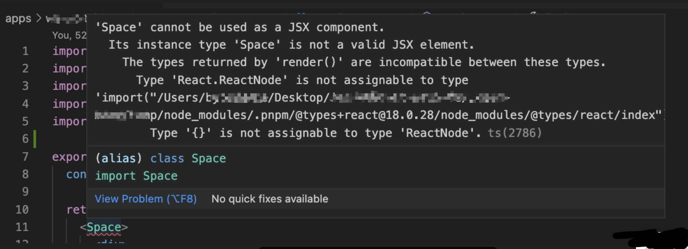
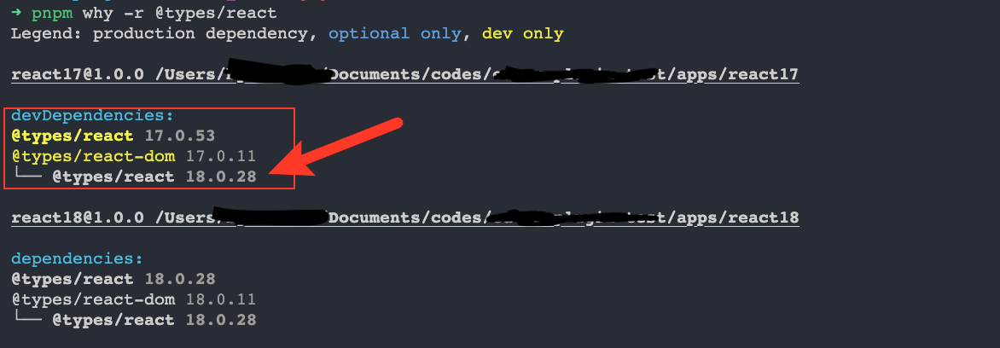

# type error of monorepo with both react@17 and @18





### 原因

react 中社区中很多包都依赖了 `dependencies "@types/react": "*"` ，造成 resolve依赖时，会拿到该monorepo下最新的 @types/react 

### 解决方案：

1. 全局 overrides, 如果你们的monorepo下都使用 react17 的功能，而没有用 react18 的功能可以使用

全局统一一个 type 包，对整体的monorepo的影响理论上来说是极小

```json
// <workspace-root>/package.json
"pnpm":{
    "@types/react": "17.0.xx"
}
```
2. 使用 tsconfig path hack一下，指向 @types/react ，在 webpack alias 中再指回来

子项目维度下，影响很小

```json
// tsconfig.json
{
    "paths": {
        "react": ["./node_modules/@types/react"]
    }
}
```
```javascript
// webpack.config.js
module.exports = {
    resolve: {
        alias: {
            react: path.resolve(__dirname, './node_modules/react')
        }
    }
}
```

相关 issue：

[DefinitelyTyped/DefinitelyTyped/pull/56210](https://github.com/DefinitelyTyped/DefinitelyTyped/pull/56210)

[react/issues/24304](https://github.com/facebook/react/issues/24304)

[redwood/issues/5104](https://github.com/redwoodjs/redwood/issues/5104)

官方解决方案:

[short-term-solution](https://github.com/facebook/react/issues/24304#issuecomment-1094565891)

[long-term-solution](https://github.com/microsoft/DefinitelyTyped-tools/issues/433)